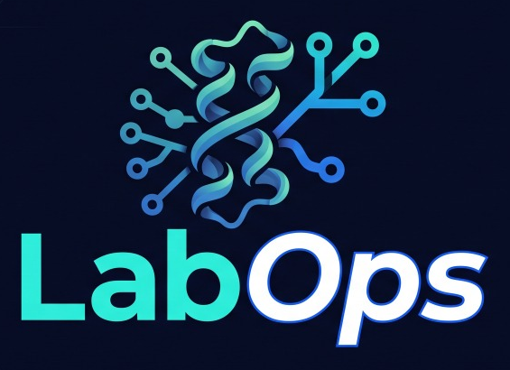

  

# LabOps

A Windows app for the MacCoss Lab. Its **Projects** area tracks the lab's work in
[LabOps-Projects](https://github.com/uw-maccosslab/LabOps-Projects): labs, their projects (one set of
samples each) and the projects' experiments, from samples received to results returned, with
sample metadata, Octopus plate layouts, and links to the data and notebooks on Panorama. Its
**Protocols** area holds the lab's protocols in
[LabOps-Protocols](https://github.com/uw-maccosslab/LabOps-Protocols), each in one format with
every version ever published, and a project's steps record the version they followed. Its
**Quotes** area, for the people who prepare them, works on the Proteomics Services quotes in
[LabOps-Quotes](https://github.com/uw-maccosslab/LabOps-Quotes). Claude Code does the
paperwork in all three, and everything stays in sync with GitHub.

[How LabOps fits together](docs/architecture.md) explains, with figures, how the app works
with the repositories, their engines, Claude Code, GitHub and Panorama.

## Installing

Download `MacCossLab.LabOps-stable-Setup.exe` from the latest
[release](https://github.com/uw-maccosslab/LabOps/releases) and run it. No
administrator rights are needed. The first time it starts, Setup walks through:

1. Installing Git (with Windows' own installer, winget).
2. Signing in to GitHub in your browser, with your lab account.
3. Installing Claude Code and signing in with your lab Claude account.
4. Downloading the lab projects to a folder you choose, or using a copy you already have, then
   the lab protocols, and the quotes too if your account has access to them.
5. Preparing the engines (downloads Python once; nothing to install yourself).

The app updates itself: when a new version is ready it shows "Update ready: restart to install".

### Coming from ChargeState

LabOps was called ChargeState until 26.7.0, and ChargeState does not update to it: install LabOps
once as above. The first time it starts it takes over ChargeState's settings (your copies of the
lab projects and quotes, and Claude conversations to resume) and its Panorama sign-in, so Setup has
nothing to ask. It then offers to open Windows' Installed apps, where you uninstall ChargeState.

## Accounts and access

What each person needs before Setup, and who gives it:

| Account or access | Who needs it | How they get it |
|---|---|---|
| A GitHub account in the [uw-maccosslab](https://github.com/uw-maccosslab) organization | Everyone | An organization owner invites them under the organization's People. Setup signs in to GitHub in the browser. |
| [LabOps](https://github.com/uw-maccosslab/LabOps): read | Everyone | Nothing to do: the repository is public. The app downloads its updates from there. |
| [LabOps-Projects](https://github.com/uw-maccosslab/LabOps-Projects): **write** | Everyone who records progress | The repository is internal, so every member can read it, but saving anything (a step, a link, a wiki page's text, Claude's work) pushes to it, which needs Write. An owner gives it on the repository's Settings > Collaborators and teams, best through a team (for example "lab", with Write). With Read only, LabOps shows the projects and refuses to save. |
| [LabOps-Protocols](https://github.com/uw-maccosslab/LabOps-Protocols): **write** | Everyone who writes, changes or publishes protocols | The repository is internal, so every member can read every protocol and version. Writing, publishing and retiring push to it, which needs Write, given the same way as for the projects (a "lab" team with Write). |
| [LabOps-Quotes](https://github.com/uw-maccosslab/LabOps-Quotes): **write** | Only the people who prepare quotes | The repository is private. An owner gives each of them Write on its Settings > Collaborators and teams. Its `config/app.yaml` lists who sees the Send button. |
| A Claude account in the lab's Claude organization | Everyone who uses Claude in the app | An admin of the lab's Claude organization adds them. Setup installs Claude Code and signs in. Tracking steps, links, View samples and the wiki page work without it; Claude's buttons do not. |
| A [Panorama](https://panoramaweb.org) account | Everyone who browses Panorama from the app or publishes a wiki page | A panoramaweb.org account with access to the lab's folders in the MacCoss project. Browsing needs Reader in those folders; publishing a project's wiki page needs Editor (or higher) in the project's folder. A Panorama admin of the MacCoss project grants these. |

The organization's base permission is **Read** today, which gives every member read access to
every repository, including the private LabOps-Quotes (prices included). To keep the quotes to
the people who prepare them, an owner sets the base permission to **No permission** (Organization
settings > Member privileges) and gives those people Write on LabOps-Quotes; LabOps is
public, and LabOps-Projects and LabOps-Protocols stay readable to every member because they are internal. The
same owner then gives LabOps-Projects and LabOps-Protocols Write to everyone who records progress or
writes protocols.

### Panorama sign-in

LabOps signs in to Panorama the way PanoramaBridge does, and asks only when it has to:

1. If PanoramaBridge is signed in on the same computer, LabOps uses that sign-in (an API key or a
   user name and password), read from Windows Credential Manager. There is nothing to do.
2. Otherwise, the first time you choose Browse or Wiki page, LabOps asks for a Panorama API key
   (recommended) or a user name and password, checks it with Panorama, and keeps it in Windows
   Credential Manager, as `LabOps:https://panoramaweb.org`, for next time. A sign-in saved by
   ChargeState is used too.

To make an API key: sign in at [panoramaweb.org](https://panoramaweb.org), open the menu under
your name (top right) and choose **API Keys** (on some versions, under My Account), then
**Generate API Key**. Copy it right away, since Panorama shows it only once, and paste it into
LabOps' sign-in window (or PanoramaBridge's). The key acts as your account, with your account's
access:

- Keep it only in a sign-in window. Never paste it into a chat with Claude, an email, a message,
  or a file in a repository.
- When it expires, LabOps says Panorama did not accept the sign-in and asks for a new one.
- To remove it from a computer, open Windows Credential Manager > Windows Credentials and remove
  `LabOps:https://panoramaweb.org` (PanoramaBridge's entry, `PanoramaBridge:https://panoramaweb.org`,
  belongs to PanoramaBridge).

Who can read a project's wiki page is set in Panorama, not in LabOps: everyone with access to the
project's folder can read it, so a lab member gives a collaboration's collaborators access to that
folder (the folder's Permissions in Panorama), and only that folder.

## Using it

Projects:

- **New project:** describe the work or paste an email; Claude sets up the lab, the project and
  its experiments. **New experiment** on a project adds another measurement of its samples.
- **Start / Done / Skip** on each step of the samples' or an experiment's timeline, with a date
  and a note. **Assign** gives a step to a person; **Add a step** covers anything the timeline does
  not show yet.
- Each step has the buttons for its work, and shows what was recorded for it. They work whatever
  the step's status, so a Panorama folder or a notebook can be recorded before the work starts:
  - **Metadata organized:** **Organize with Claude** (choose the collaborator's sample sheet; it
    is checked for identifying information first and never shared, and Claude builds the sample
    table from it) and **View samples** (the table in a grid to sort and search, with the QC rows
    counted, and the deidentified files it was made from).
  - **Plate layout:** **Open in Octopus** and **Import layout**, to lay the samples out on plates
    and keep the layout.
  - **Sample prep** (or an experiment's assay development or data acquisition): **Add notebook**,
    the ELN notebook on Panorama, and **Add protocol**, the protocol the work followed at the
    published version used. The protocol then shows on the step; clicking it opens that version
    in the Protocols area, and the project's wiki page lists it.
  - **Data deposited to Panorama:** **Add raw data folder**, where PanoramaBridge uploads.
  - **Signal processing:** **Add results folder**, with the Skyline documents.
  - **Browse...** finds folders and notebooks on Panorama, signed in the way PanoramaBridge is. A
    timeline without the step keeps its buttons beside its heading.
- **Wiki page:** the project's page on Panorama, as in the BioTRACK folder: status, every step with
  its dates, who and notes, the samples, and the data with their Skyline documents. Preview it,
  have Claude write its summary, plan and description of the samples, and publish it; after that
  the app republishes it after every change. The collaborators who can open the folder read it.
- The list shows active and on-hold projects; **Show closed** adds the closed ones.

Protocols:

- The list shows every protocol by category, with its current version and when it was published;
  **Show retired** adds the retired ones. **Showing** picks any version ever published, or the
  draft, and shows it as the printable page; **Print** opens it in the browser to print or save
  as a PDF.
- **New protocol:** give a title and a category, and choose the original if there is one (Word,
  PDF, LaTeX, Markdown or text). Claude writes it in the lab's format, lists every correction and
  question for you to check, and it stays a draft.
- **Ask Claude to change it** and **Update from a file** (a newer original) change the draft; the
  published versions stay as they are. **Show changes** shows what the draft changes since the
  current version.
- **Publish version N** makes the draft the next version, the one to use at the bench, with what
  it changes. A published version never changes. **Retire** marks a protocol as no longer used,
  naming the one that replaces it.

Quotes:

- **New quote:** paste the request email, or give a Gmail search that finds it. Claude drafts
  the quote and shows a summary.
- **Ask Claude to change it:** describe the change in plain words.
- **Send / PO received / Invoiced / Declined / Make a revision:** one button each. Send is shown
  only to the approvers listed in the quotes repository.
- Everything you do is saved to GitHub right away, and other people's work arrives on its own.

## Developing

See [docs/](docs/README.md) for how the pieces fit together, and [CLAUDE.md](CLAUDE.md) for
working on the code.
