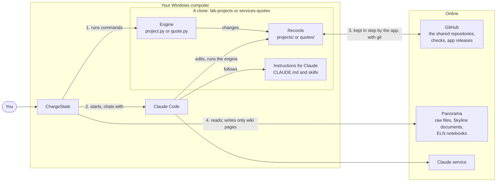
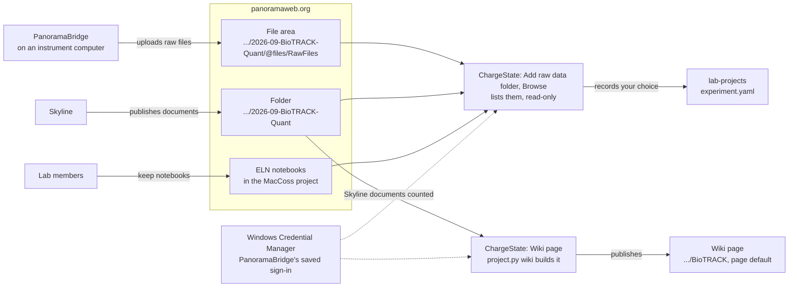
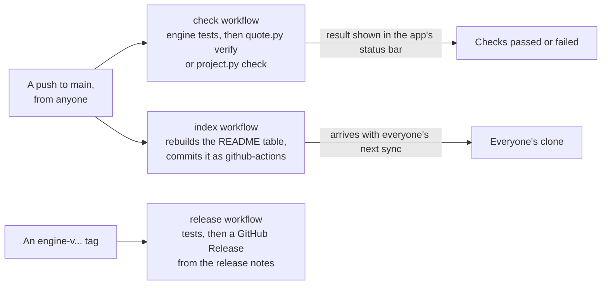
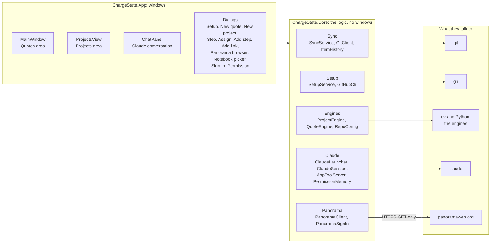
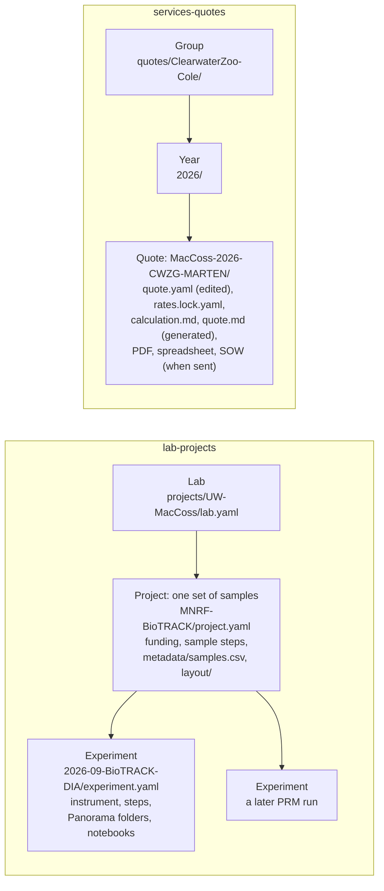
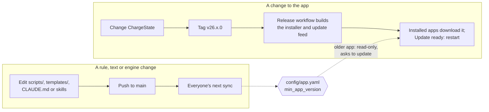

# How ChargeState fits together

ChargeState is a Windows app, but most of what it shows and changes lives somewhere else: in two
git repositories on GitHub, in the Python engines inside those repositories, in Claude Code, and
on Panorama. This page explains those pieces and how they connect. [How it works, step by
step](flows.md) follows the main actions through them.

Three ideas explain most of the design:

1. **The records are git repositories.** Projects live in
   [lab-projects](https://github.com/uw-maccosslab/lab-projects) and quotes in
   [services-quotes](https://github.com/uw-maccosslab/services-quotes). Everyone works on their own
   copy (a clone), and the app keeps it in step with GitHub: it saves each change as a commit and
   brings in everyone else's.
2. **Each repository carries its own rules.** Its engine (`scripts/project.py` or
   `scripts/quote.py`), its `CLAUDE.md` and its Claude skills decide prices, validation, wording and
   what counts as identifying information. The app runs the engine and shows the answer; it never
   computes a price or judges a sample sheet itself. So a rule change reaches everyone on their
   next sync, without an app release.
3. **Claude edits files; the app alone saves them.** Claude Code runs inside the app and does the
   paperwork. When it finishes a turn, the app checks, commits and pushes what it changed. Claude
   is not allowed to run git commands that change history.

## The big picture



1. **The engine** does every calculation, and every change a button asks for. The app runs it as
   a command and reads the answer it prints.
2. **Claude Code** does the paperwork in the same folder, following the repository's
   instructions, and runs the same engine.
3. **git** carries every change to and from GitHub. The app commits and syncs; GitHub runs each
   repository's checks after every push.
4. **Panorama** is read to choose an experiment's folders and notebook, and to count the Skyline
   documents in them. The one thing the app writes there is each project's wiki page.

### Panorama and PanoramaBridge



ChargeState signs in to Panorama with the sign-in PanoramaBridge saved on the computer (an API key
or a user name and password). Only if there is none, or Panorama no longer accepts it, does it ask
for one and keep it under its own name.

### What GitHub does after a push



## The pieces

| Piece | What it is | Where it runs | How it changes for everyone |
|---|---|---|---|
| ChargeState | This app: .NET 10, WPF | Each person's Windows computer | A release (`v26.x.0` tag); installed copies update themselves |
| lab-projects | Labs, projects, experiments, deidentified sample tables, plate layouts. Open to the lab. | GitHub, plus a clone on each computer | A push to `main`; others get it on their next sync |
| services-quotes | Quotes, rates, templates. Private to the people who prepare quotes. | GitHub, plus a clone where needed | A push to `main` |
| `project.py`, `quote.py` | The engines: every rule, command and generated file | Inside each clone, run with uv and Python | Pushed with the repository; tagged `engine-v...` for release notes |
| `CLAUDE.md`, `.claude/skills/` | What Claude follows in each repository | Inside each clone | Pushed with the repository |
| `config/app.yaml` | `min_app_version`, and for quotes the `approvers` who may send | Inside each clone | Pushed with the repository |
| Claude Code | `claude.exe`, one process per conversation | Started by the app in the clone's folder | Its own updates |
| GitHub Actions | `check` (tests and validation), `index` (README table), `release` | GitHub | Workflow files in each repository |
| Panorama | Raw data (WebDAV file areas), Skyline documents, the lab's ELN | panoramaweb.org | Not changed by ChargeState |

The quotes repository is optional. A lab member without access to it sees only the Projects area.

## Inside the app



- **One `Repository` per clone.** `RepositoryProfile` holds what differs between the two
  repositories: the GitHub name, the engine, the folder that holds the items
  (`projects/<Lab>/<Project>` or `quotes/<Group>/<year>/<number>`), the files the engine generates
  (`calculation.md`, `quote.md`), and whether commits must pass the identifier check
  (lab-projects only). Each open clone gets its own `GitClient` and `SyncService`; `Workspace`
  holds the ones that are open.
- **Engines are separate programs.** `ProjectEngine` and `QuoteEngine` run
  `uv run --frozen python scripts/<engine>.py --json <command>` in the clone and read the JSON it
  prints. The table below lists what each button runs.
- **Claude talks to the app through a small local server.** `AppToolServer` listens on
  `127.0.0.1` (a random port, with a secret token) and gives Claude three tools: `ask_user`
  (a question in the chat pane), `report_quote_summary` (the quote card) and `approve` (the
  permission prompt). It is named `quotes-app` in both repositories, for historical reasons.
- **Panorama is read, except for wiki pages.** The app reads folder listings, the notebook list
  and each results folder's Skyline documents, and writes one thing: a project's wiki page
  (`wiki-saveWiki.api`), built by `project.py wiki`. LabKey wants a CSRF token on every POST, even
  with an API key, so the save first gets one from `login-whoami.api` and sends it with that
  session's cookies. The app republishes a page on its own only when the page's footer marks it as
  ChargeState's, nobody has edited it on Panorama since (the footer fingerprints the page), and its
  written parts are the ones published last; replacing a page written or edited by hand, and
  publishing new text from Claude, are done in the Wiki page window. What you choose when browsing is written to lab-projects by `project.py link`.
- **The bundled tools.** The installer carries pinned copies of `uv` and `gh` in its `tools`
  folder. Git and Claude Code are installed by Setup.

### What each action runs

| In the app | Engine command | Saved as |
|---|---|---|
| Projects list, quotes list | `project.py list --active` (`list` with Show closed), `quote.py list` | nothing |
| View samples | none: the app reads `metadata/samples.csv` and `metadata/received/*.csv` | nothing |
| Start, Done, Skip, Reopen a step | `project.py stage <item> <step> start\|done\|skip` | `<item>: <step> done` |
| Assign | `project.py assign <item> <steps> --to <login>` | `<item>: <step> assigned to <login>` |
| Add a step, Remove a step | `project.py add-step`, `remove-step` | `<item>: added step ...` |
| Add notebook, Add raw data folder, Add results folder, Remove a link | `project.py link`, `unlink` | `<item>: raw data on Panorama` |
| Organize with Claude | `project.py scan <file>`, then Claude | `<project>: updated with Claude` |
| Wiki page (the first time: where it goes) | `project.py link <project> wiki <folder> --page <name>` | `<project>: wiki page on Panorama` |
| Wiki page, Publish; and after every saved change | `project.py wiki <project> --documents <file>`, then Panorama's `wiki-saveWiki.api` | nothing in git |
| Write the text with Claude | the update-wiki skill writes `wiki.yaml` | `<project>: updated with Claude` |
| Open in Octopus, Import layout | `project.py octopus-input`, `import-layout` | `<project>: plate layout from Octopus` |
| Every commit in lab-projects | `project.py check --staged` | refuses the commit on an error |
| Send, PO received, Invoiced, Declined | `quote.py send`, `quote.py status` | `<number>: sent` |
| Make a revision | `quote.py revise` | `<revision>: revision of <number>` |
| Draft PDF | `quote.py pdf` | nothing (an untracked draft) |
| Statement of work | `quote.py sow --samples ...` | `<number>: statement of work` |
| New quote, New project, Ask Claude | Claude runs the engine through the skills | `<item>: draft with Claude`, `added with Claude` |
| A conflict in a generated file | `quote.py build <quote>` | part of the sync |

The engines have more commands than the app uses (`new`, `new-project`, `new-experiment`,
`index`, `verify`, `check`, ...). Claude, GitHub Actions and people at a terminal use those.

## The repositories



Both repositories have the same outline:

```
CLAUDE.md                 what Claude follows; conventions for people too
.claude/skills/           step-by-step procedures (new-quote, update-experiment, ...)
config/app.yaml           min_app_version; the quotes also list approvers
scripts/                  the engine
templates/                starting files and text
tests/                    the engine's tests (pytest)
release-notes/            one file per engine release (engine-v...)
.github/workflows/        check, index, release
README.md                 the human index; its table is regenerated after every push
```

lab-projects also has `inbox/`, where collaborators' original files go. Git ignores it, so
originals never leave the computer. Its `.githooks/pre-commit` runs the identifier check for
people who use git directly; the app sets `core.hooksPath` to it.

## Where things live on a computer

| What | Where |
|---|---|
| The app | Installed per user by Velopack, with `tools\uv.exe` and `tools\gh.exe` beside it |
| Settings | `%LOCALAPPDATA%\ChargeState\settings.json`: the two clone folders, Claude conversation ids per item, the sync interval (5 minutes), window size, beta updates. No passwords. |
| Logs | `%LOCALAPPDATA%\ChargeState\logs\`, one file a day, kept 14 days, secrets removed |
| Claude's tool server address | `%LOCALAPPDATA%\ChargeState\claude\mcp-*.json`, written each run |
| Clones | `Documents\lab-projects`, `Documents\services-quotes` (or folders you choose) |
| Engine environment | `.venv` inside each clone, made by `uv sync` |
| Panorama sign-in | Windows Credential Manager: `PanoramaBridge:https://panoramaweb.org` (PanoramaBridge's, only read) and `ChargeState:https://panoramaweb.org` (ChargeState's own, only when needed) |
| GitHub sign-in | The gh CLI's, set up during Setup |

`CHARGESTATE_DATA` moves the app's folder elsewhere, which is how a test copy runs beside the
real one. `CHARGESTATE_PANORAMA` points Panorama browsing at another server, for testing.

## How changes reach people



Most changes are on the left and reach people within minutes. When a repository needs a newer app,
for example a new layout the app must read, its `config/app.yaml` raises `min_app_version` once
that app is released. Older copies then show a banner, keep working read-only, and update.

Releases follow the [release notes convention](../release-notes/README.md): an app release is
tagged `v{version}`, an engine release `engine-v{version}` in its repository.
