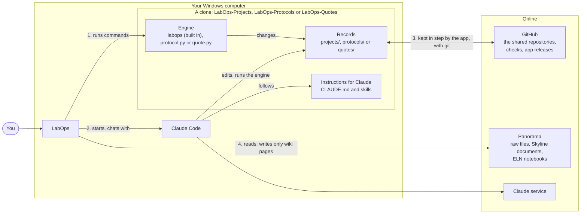
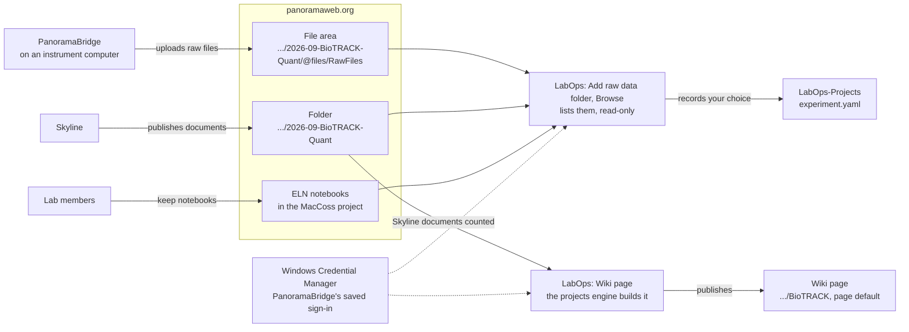
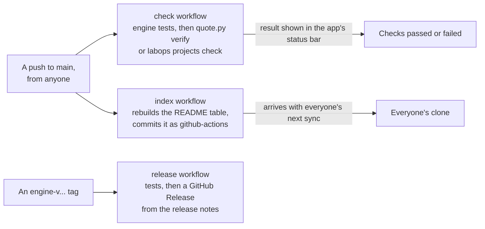
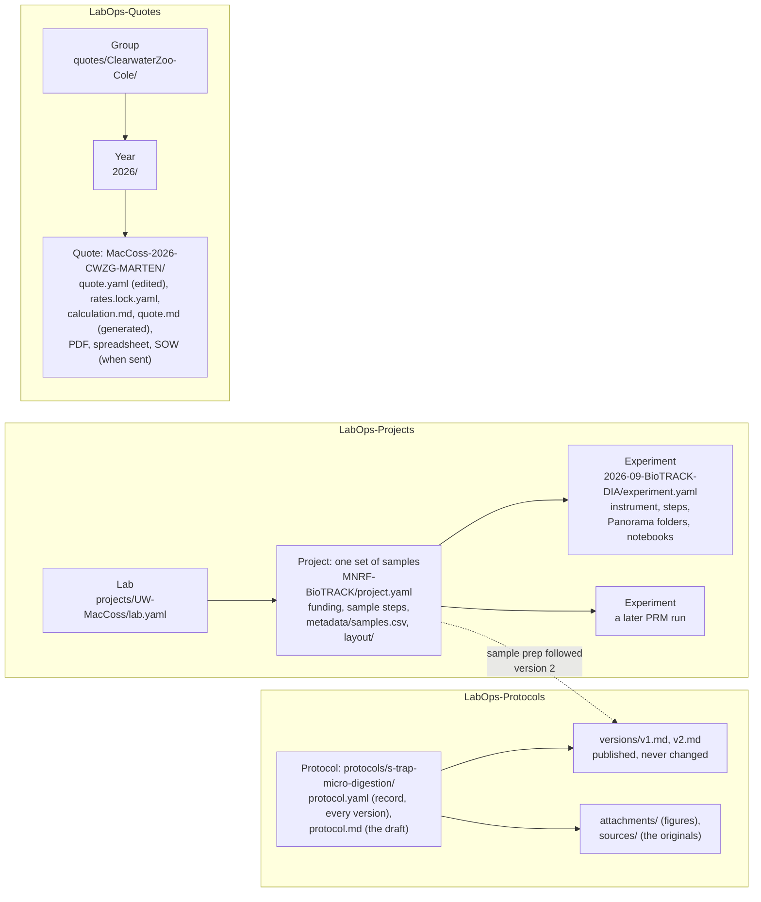
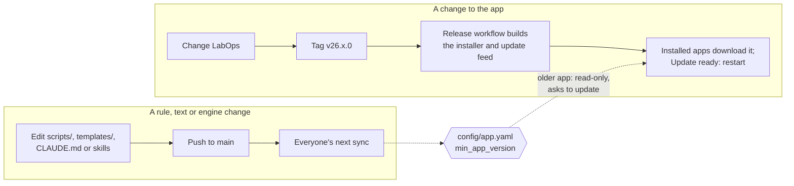

# How LabOps fits together

LabOps is a Windows app, but most of what it shows and changes lives somewhere else: in two
git repositories on GitHub, in the Python engines inside those repositories, in Claude Code, and
on Panorama. This page explains those pieces and how they connect. [How it works, step by
step](flows.md) follows the main actions through them.

Three ideas explain most of the design:

1. **The records are git repositories.** Projects live in
   [LabOps-Projects](https://github.com/uw-maccosslab/LabOps-Projects) and quotes in
   [LabOps-Quotes](https://github.com/uw-maccosslab/LabOps-Quotes). Everyone works on their own
   copy (a clone), and the app keeps it in step with GitHub: it saves each change as a commit and
   brings in everyone else's.
2. **Each repository carries its own records, text and skills; the engines decide the rules.** The
   quotes' and protocols' engines (`scripts/quote.py`, `scripts/protocol.py`) live in their
   repositories, so a change to one reaches everyone on their next sync. The projects engine was
   `scripts/project.py` until October 2026; it is now part of LabOps (`LabOps.Engines`, a C# port
   that gives the same answers), run in-process by the app and as the `labops` tool by Claude's
   skills, the pre-commit hook and GitHub Actions. A change to a projects rule is an app release,
   and `config/app.yaml`'s `min_app_version` makes sure nobody edits with an app that lacks it.
3. **Claude edits files; the app alone saves them.** Claude Code runs inside the app and does the
   paperwork. When it finishes a turn, the app checks, commits and pushes what it changed. Claude
   is not allowed to run git commands that change history.

## The big picture



1. **The engine** does every calculation, and every change a button asks for. The app runs it as
   a command and reads the answer it prints.
2. **Claude Code** does the paperwork in the same folder, following the repository's
   instructions, and runs the same engine.
3. **git** carries every change to and from GitHub. The app commits and syncs; GitHub runs each
   repository's checks after every push.
4. **Panorama** is read to choose an experiment's folders and notebook, and to count the Skyline
   documents in them. The one thing the app writes there is each project's wiki page.

### Panorama and PanoramaBridge



LabOps signs in to Panorama with the sign-in PanoramaBridge saved on the computer (an API key
or a user name and password). Only if there is none, or Panorama no longer accepts it, does it ask
for one and keep it under its own name.

### What GitHub does after a push



## The pieces

| Piece | What it is | Where it runs | How it changes for everyone |
|---|---|---|---|
| LabOps | This app: .NET 10, WPF. Public. | Each person's Windows computer | A release (`v26.x.0` tag); installed copies update themselves |
| LabOps-Projects | Labs, projects, experiments, deidentified sample tables, plate layouts. Open to the lab. | GitHub, plus a clone on each computer | A push to `main`; others get it on their next sync |
| LabOps-Protocols | The lab's protocols, every published version, figures and originals. Open to the lab. | GitHub, plus a clone on each computer | A push to `main` |
| LabOps-Quotes | Quotes, rates, templates. Private to the people who prepare quotes. | GitHub, plus a clone where needed | A push to `main` |
| `protocol.py`, `quote.py` | The quotes' and protocols' engines: every rule, command and generated file | Inside each clone, run with uv and Python | Pushed with the repository; tagged `engine-v...` for release notes |
| `LabOps.Engines`, `labops` | The projects engine (the port of `project.py`), in the app and as its command-line tool | Inside LabOps; `labops.exe` in its `tools` folder | A LabOps release |
| `CLAUDE.md`, `.claude/skills/` | What Claude follows in each repository | Inside each clone | Pushed with the repository |
| `config/app.yaml` | `min_app_version`, and for quotes the `approvers` who may send | Inside each clone | Pushed with the repository |
| Claude Code | `claude.exe`, one process per conversation | Started by the app in the clone's folder | Its own updates |
| GitHub Actions | `check` (tests and validation), `index` (README table), `release` | GitHub | Workflow files in each repository |
| Panorama | Raw data (WebDAV file areas), Skyline documents, the lab's ELN | panoramaweb.org | Not changed by LabOps |

The quotes repository is optional. A lab member without access to it sees the Projects and
Protocols areas. The protocols are optional in Setup too, so an updated app opens before anyone
downloads them; until then the Protocols area offers Setup.

## Inside the app


- **One `Repository` per clone.** `RepositoryProfile` holds what differs between the two
  repositories: the GitHub name, the engine, the folder that holds the items
  (`projects/<Lab>/<Project>` or `quotes/<Group>/<year>/<number>`), the files the engine generates
  (`calculation.md`, `quote.md`), and whether commits must pass the identifier check
  (LabOps-Projects only). Each open clone gets its own `GitClient` and `SyncService`; `Workspace`
  holds the ones that are open.
- **The quotes' and protocols' engines are separate programs.** `QuoteEngine` and `ProtocolEngine`
  run `uv run --frozen python scripts/<engine>.py --json <command>` in the clone and read the JSON
  it prints. `ProjectEngine` builds the same command lines `project.py` took and runs them
  in-process (`ProjectsCommandLine` in `LabOps.Engines`), getting the same JSON back; the `labops`
  tool runs those command lines for Claude, the hook and CI. The table below lists what each button
  runs, as the command line Claude would type.
- **Claude talks to the app through a small local server.** `AppToolServer` listens on
  `127.0.0.1` (a random port, with a secret token) and gives Claude three tools: `ask_user`
  (a question in the chat pane), `report_quote_summary` (the quote card) and `approve` (the
  permission prompt). It is named `quotes-app` in both repositories, for historical reasons.
- **Panorama is read, except for wiki pages.** The app reads folder listings, the notebook list
  and each results folder's Skyline documents, and writes one thing: a project's wiki page
  (`wiki-saveWiki.api`), built by the engine's `wiki` command. LabKey wants a CSRF token on every POST, even
  with an API key, so the save first gets one from `login-whoami.api` and sends it with that
  session's cookies. The app republishes a page on its own only when the page's footer marks it as
  LabOps's, nobody has edited it on Panorama since (the footer fingerprints the page), and its
  written parts are the ones published last; replacing a page written or edited by hand, and
  publishing new text from Claude, are done in the Wiki page window. What you choose when browsing is written to LabOps-Projects by the engine's `link` command.
- **The bundled tools.** The installer carries pinned copies of `uv` and `gh` in its `tools`
  folder, and the `labops` tool (compiled ahead of time, so it needs no .NET). Git and Claude Code
  are installed by Setup.

### What each action runs

| In the app | Engine command | Saved as |
|---|---|---|
| Projects list, quotes list | `labops projects list --active` (`list` with Show closed), `quote.py list` | nothing |
| View samples | none: the app reads `metadata/samples.csv` and `metadata/received/*.csv` | nothing |
| Start, Done, Skip, Reopen a step | `labops projects stage <item> <step> start\|done\|skip` | `<item>: <step> done` |
| Assign | `labops projects assign <item> <steps> --to <login>` | `<item>: <step> assigned to <login>` |
| Add a step, Remove a step | `labops projects add-step`, `remove-step` | `<item>: added step ...` |
| Add notebook, Add raw data folder, Add results folder, Remove a link | `labops projects link`, `unlink` | `<item>: raw data on Panorama` |
| Organize with Claude | `labops projects scan <file>`, then Claude | `<project>: updated with Claude` |
| Wiki page (the first time: where it goes) | `labops projects link <project> wiki <folder> --page <name>` | `<project>: wiki page on Panorama` |
| Wiki page, Publish; and after every saved change | `labops projects wiki <project> --documents <file>`, then Panorama's `wiki-saveWiki.api` | nothing in git |
| Write the text with Claude | the update-wiki skill writes `wiki.yaml` | `<project>: updated with Claude` |
| Open in Octopus, Import layout | `labops projects octopus-input`, `import-layout` | `<project>: plate layout from Octopus` |
| Every commit in LabOps-Projects | `labops projects check --staged` | refuses the commit on an error |
| Protocols list | `protocol.py list` | nothing |
| Showing a version, Print | `protocol.py render <id> --version N --out <file>` | nothing |
| Show changes | `protocol.py diff <id>` | nothing |
| New protocol (from a file), Update from a file | `protocol.py import <file>`, then Claude (format-protocol, revise-protocol) | `<id>: added with Claude` |
| Publish version N | `protocol.py publish <id> --summary ... --by <login>` | `<id>: version N` |
| Retire, Make active | `protocol.py status <id> retired\|active` | `<id>: retired` |
| Add protocol (on a step) | `labops projects link <item> protocol <id> --version N --step <step>` | `<item>: protocol <id> version N for <step>` |
| Every commit in LabOps-Protocols | `protocol.py check --staged` | refuses a change to a published version |
| Send, PO received, Invoiced, Declined | `quote.py send`, `quote.py status` | `<number>: sent` |
| Make a revision | `quote.py revise` | `<revision>: revision of <number>` |
| Draft PDF | `quote.py pdf` | nothing (an untracked draft) |
| Statement of work | `quote.py sow --samples ...` | `<number>: statement of work` |
| New quote, New project, Ask Claude | Claude runs the engine through the skills | `<item>: draft with Claude`, `added with Claude` |
| A conflict in a generated file | `quote.py build <quote>` | part of the sync |

The engines have more commands than the app uses (`new`, `new-project`, `new-experiment`,
`index`, `verify`, `check`, ...). Claude, GitHub Actions and people at a terminal use those.

## The repositories



All three repositories have the same outline:

```
CLAUDE.md                 what Claude follows; conventions for people too
.claude/skills/           step-by-step procedures (new-quote, update-experiment, ...)
config/app.yaml           min_app_version; the quotes also list approvers
scripts/                  the engine
templates/                starting files and text
tests/                    the engine's tests (pytest)
release-notes/            one file per engine release (engine-v...)
.github/workflows/        check, index, release
README.md                 the human index; its table is regenerated after every push
```

LabOps-Projects also has `inbox/`, where collaborators' original files go. Git ignores it, so
originals never leave the computer. Its `.githooks/pre-commit` runs the identifier check for
people who use git directly; the app sets `core.hooksPath` to it.

LabOps-Protocols has an `inbox/` too, for uploads being formatted, and its pre-commit hook refuses
any change to a published version: its text (fingerprinted in `protocol.yaml`), its record, or a
figure it shows. Its `check` workflow runs `protocol.py verify` against the commit before each
push, so a change made without the hook is caught too.

## Where things live on a computer

| What | Where |
|---|---|
| The app | Installed per user by Velopack, with `tools\uv.exe` and `tools\gh.exe` beside it |
| Settings | `%LOCALAPPDATA%\LabOps\settings.json`: the two clone folders, Claude conversation ids per item, the sync interval (5 minutes), window size, beta updates. No passwords. |
| Logs | `%LOCALAPPDATA%\LabOps\logs\`, one file a day, kept 14 days, secrets removed |
| Claude's tool server address | `%LOCALAPPDATA%\LabOps\claude\mcp-*.json`, written each run |
| Clones | `Documents\LabOps-Projects`, `Documents\LabOps-Quotes` (or folders you choose) |
| Engine environment | `.venv` inside each clone, made by `uv sync` |
| Panorama sign-in | Windows Credential Manager: `PanoramaBridge:https://panoramaweb.org` (PanoramaBridge's, only read) and `LabOps:https://panoramaweb.org` (LabOps's own, only when needed) |
| GitHub sign-in | The gh CLI's, set up during Setup |

`LABOPS_DATA` moves the app's folder elsewhere, which is how a test copy runs beside the
real one. `LABOPS_PANORAMA` points Panorama browsing at another server, for testing.

## How changes reach people



Most changes are on the left and reach people within minutes. When a repository needs a newer app,
for example a new layout the app must read, its `config/app.yaml` raises `min_app_version` once
that app is released. Older copies then show a banner, keep working read-only, and update.

Releases follow the [release notes convention](../release-notes/README.md): an app release is
tagged `v{version}`, an engine release `engine-v{version}` in its repository.
