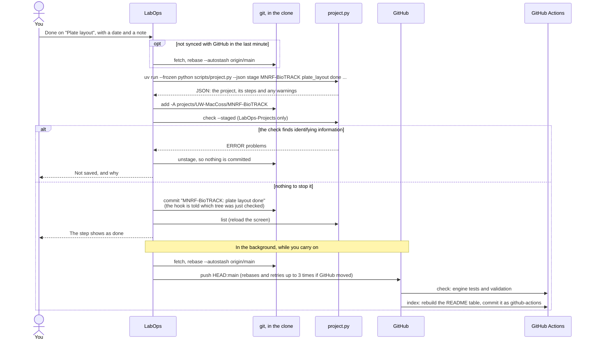
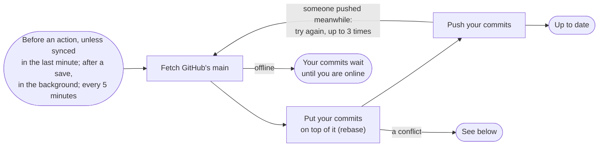
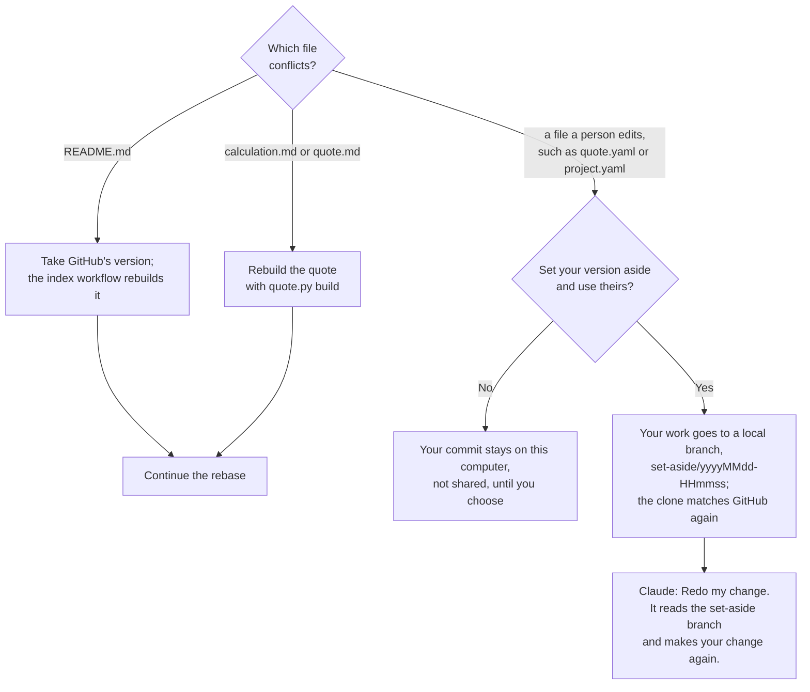
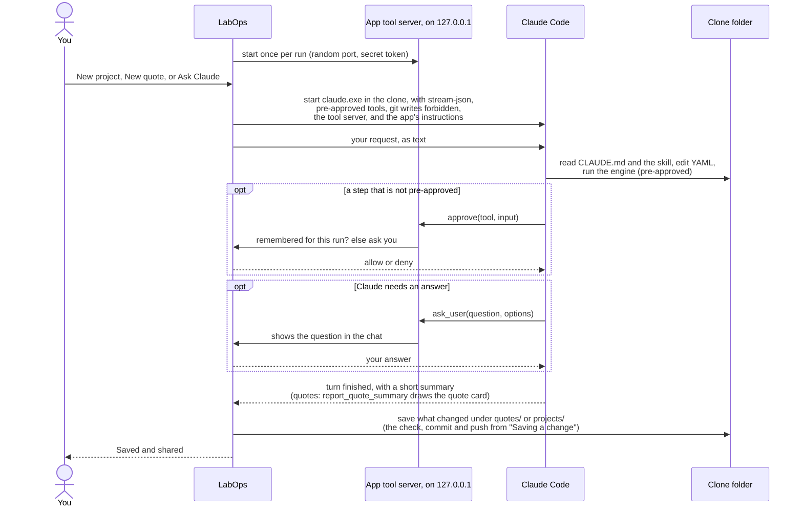
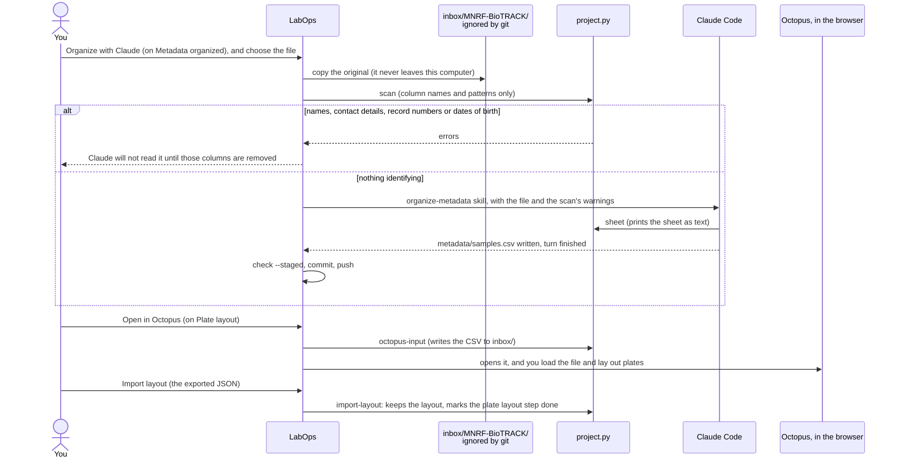
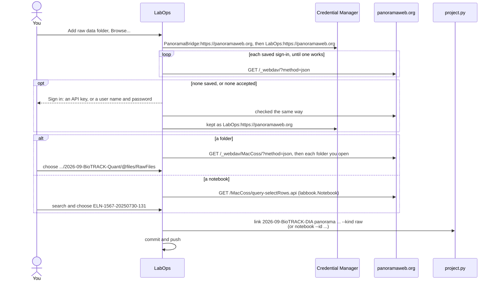
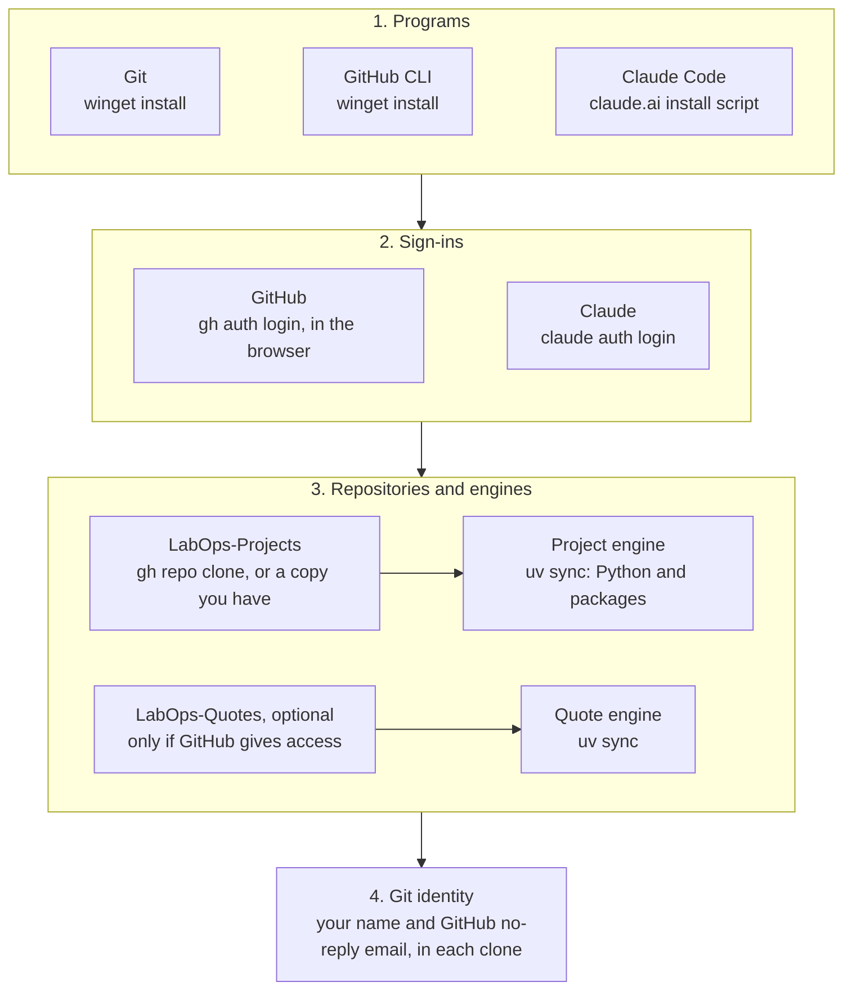
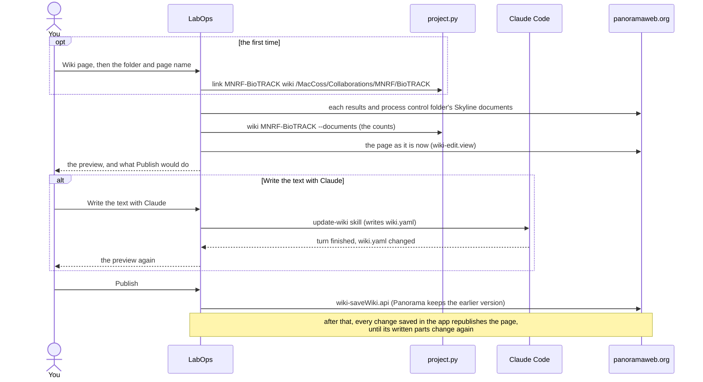

# How it works, step by step

These follow the main actions through the app, the engines, git, GitHub, Claude and Panorama.
[How LabOps fits together](architecture.md) introduces the pieces.

- [Saving a change](#saving-a-change)
- [Staying in sync, and what happens on a conflict](#staying-in-sync-and-what-happens-on-a-conflict)
- [A conversation with Claude](#a-conversation-with-claude)
- [Organizing a collaborator's sample sheet](#organizing-a-collaborators-sample-sheet)
- [Choosing a Panorama folder or notebook](#choosing-a-panorama-folder-or-notebook)
- [A protocol, from upload to bench](#a-protocol-from-upload-to-bench)
- [First-run setup](#first-run-setup)

## Saving a change

Every button that changes something works the same way: make sure the copy is current, run the
engine, commit on this computer and show the result, then share with GitHub in the background.
Here, marking a step done in the Projects area:



- **The engine does the work.** The app passes what you chose; the engine edits the YAML, keeps
  its comments, and validates the result.
- **You see the change before GitHub does.** Sharing takes about 3 seconds (a fetch, a rebase
  and a push), so it happens after the screen updates. The next action, and anything Claude
  does, waits for a share still running. Offline, the commit waits on this computer and the
  status bar says so; the next sync shares it.
- **No fetch right after a sync.** If the copy synced with GitHub in the last minute (usually
  because the previous change was just shared), the action starts at once; the rebase before
  sharing still brings in anything newer.
- **LabOps-Projects checks every commit.** The app runs `check --staged` before it commits and tells
  the repository's pre-commit hook which staged tree it checked (`LABOPS_CHECKED_TREE`). The
  hook skips only that exact tree and checks anything else, including every commit made outside
  the app. A refusal leaves the files changed but uncommitted.
- **After a Claude turn,** the app saves and waits for GitHub before saying "Saved and shared".
- **The Quotes area is the same,** without the identifier check: for example Send runs
  `quote.py send`, then saves `"<number>: sent"`.
- **Timings are in the log** (`%LOCALAPPDATA%\LabOps\logs`): each engine command, each commit
  and each sync with GitHub, with how long it took.

## Staying in sync, and what happens on a conflict

The app never merges. It rebases your commits onto GitHub's, the way the pwiz-ai repository works.
Every 5 minutes it also brings in others' work when you have nothing unsaved (and checks for an app
update every 4 hours).



Two people working on different quotes or projects never conflict, because each item has its own
folder. When a rebase does stop on a conflict, what happens depends on the file:



It never guesses between two people's versions of the same file.

## A conversation with Claude



- **What Claude may do without asking:** read and edit files, search, run the repository's
  engine, and look at files with `git status`, `git diff`, `git log`, `git show`, `cat`, `head`,
  `tail`, `sed -n`, `wc` and `ls`. It may never commit, push, pull, rebase, reset, check out or
  stash, and it has no web access.
- **Anything else asks you.** Choosing "Allow ... until LabOps closes" remembers that program
  for this repository until you close the app. A command that hides another one inside `$(...)` is
  asked about every time.
- **The conversation belongs to one item.** Its id is kept in `settings.json`, so Ask Claude can
  continue it later.
- **After a turn,** only changes inside `quotes/` or `projects/` are saved. In the Quotes area an
  approver is asked about changes elsewhere (the engine, templates); in the Projects area they are
  never saved. If the identifier check refuses, the app tells Claude what it found and asks it to
  fix the files.

## Organizing a collaborator's sample sheet



## Choosing a Panorama folder or notebook

**Add raw data folder** (on Data deposited to Panorama) and **Add results folder** (on Signal
processing) record where an experiment's raw data and Skyline documents are on Panorama; **Add
notebook** (on Sample prep, or an experiment's first bench step) records its ELN notebook. Each
works whatever the step's status. **Browse...** finds them on Panorama, signed in the way
PanoramaBridge is.



- **Read-only.** Browsing sends only `GET` requests to Panorama; what you choose is written to
  LabOps-Projects. (The wiki page, below, is the one thing written to Panorama.)
- **Folders:** raw files are in a folder's `@files` area (where PanoramaBridge uploads), and are
  recorded with that part, for example
  `/MacCoss/Collaborations/MNRF/BioTRACK/2026-09-BioTRACK-Quant/@files/RawFiles`. The folder itself,
  with the Skyline documents, is recorded as **results**.
- **Notebooks:** the number at the end of an ELN ID is the notebook's, so the link is
  `https://panoramaweb.org/MacCoss/samplemanager-app.view#/notebooks/131`. A notebook recorded by
  ID alone gets that link too.

## A protocol, from upload to bench

```mermaid
sequenceDiagram
    actor You
    participant App as LabOps
    participant Inbox as inbox/<id>/<br/>ignored by git
    participant Engine as protocol.py
    participant Claude as Claude Code
    participant Projects as project.py

    You->>App: New protocol: title, category, and the original (Word, PDF, LaTeX, ...)
    App->>Engine: import (extracts the text and figures)
    Engine->>Inbox: the original, text.md, images/
    App->>Claude: format-protocol skill, with where the text is
    Claude->>Engine: new, then check
    Claude-->>App: protocol.md written, corrections and questions listed, turn finished
    App->>App: check --staged, commit, push (a draft)
    You->>App: review it (Ask Claude to change it), then Publish version 1
    App->>Engine: publish: versions/v1.md, its fingerprint, the summary
    App->>App: check --staged, commit, push
    You->>App: Add protocol, on a project's Sample prep
    App->>Projects: link <project> protocol <id> --version 1 --step sample_prep
    Note over App,Projects: the step shows "Protocol: ..., version 1"; clicking it opens that version
```

A later change goes in the draft, never in a published version: Publish makes version 2, and a
project that recorded version 1 still opens exactly what it followed. The pre-commit check and the
`check` workflow refuse any change to a published version.

## First-run setup



Each clone is set to rebase on pull with autostash, and LabOps-Projects to use its `.githooks`. Setup
runs again whenever something is missing, for example after the engines are deleted or a sign-in
expires.

## The project's wiki page

**Wiki page** on a project shows its page on Panorama as it would be published: the status, the
figures, every step with its dates, who and note, the samples, the Panorama folders with their
Skyline documents, and where the records are. Everyone who can open the folder reads it, the
collaborators of that collaboration included; a lab member decides who that is, in Panorama.



- **Kept up to date:** after each change saved in the app (a step, a link, Claude's work), the app
  rebuilds and republishes the page in the background, and says so in the status bar. It does so
  only for a page whose footer marks it as LabOps's, that nobody has edited on Panorama since,
  and only while the written parts (`wiki.yaml`) are the ones last published; new text, and a page
  edited on Panorama, wait in the Wiki page window for a person.
- **Written parts:** the summary, plan, description of the samples and a sentence per data folder
  are Claude's, in the project's `wiki.yaml`; everything else comes from the records each time.
- **A page written or edited by hand** is replaced only from the Wiki page window, after a
  question; Panorama keeps the earlier version in the page's history.
